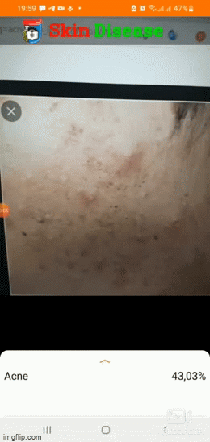

## Phát hiện tổn thương da bằng học sâu
- Tải cái package với requirements.txt
- train mô hình 
- test kết quả
- deloy trên android

#### Mục tiêu
Xây dựng phần mềm android đê nhận diện tổn thuong da bằng học sâu


<div align="center">    
 
# DetectDamebyDeepLearning   


<a></a>

<!--  
Conference   
-->   
</div>


## Miêu tả
Ở một quốc gia nhiệt đới, các bệnh ngoài da xảy ra phổ biến, cần một biện pháp để phát hiện sớm các bệnh ngoài da kịp thời để dễ dàng điều trị. Và deep learning là một công cụ tiềm năng để giải quyết vấn đề này. Chúng tôi training mô hình mobilenetv2(mô hình deep learning thân thiện cho các thiết bị mobile) để thực hiện bài toán phân loại trên tập dữ liệu của chúng tôi (lấy 4 nhãn bệnh phổ biến trong tập dữ liệu dermnet và thêm 1 nhãn normal do chúng tôi tự thêm vào). Sau khi khi kết thúc, chúng tôi có thể deloy trên android để tiến hành nhận diện

# DetectDamebyDeepLearning
 Training mô hình deep learning và deloy trên android
## How to run
Đầu tiên, cài các package phụ thuộc
```bash
# clone project   
git clone https://github.com/cuong3004/DetectDamebyDeepLearning

# install project   
cd DetectDamebyDeepLearning
pip install -r requirements.txt
 ```
Tiếp theo, download data
 ```bash
sh download_data.sh
 ```
 