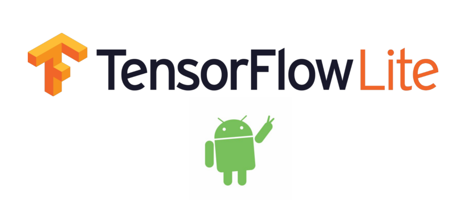

## Phát hiện tổn thương da bằng học sâu
- Tải cái package với requirements.txt
- train mô hình 
- test kết quả
- deloy trên android

#### Mục tiêu
Xây dựng phần mềm android đê nhận diện tổn thuong da bằng học sâu


<div align="center">    
 
# DetectDamebyDeepLearning   


<a></a>

<!--  
Conference   
-->   
</div>


## Miêu tả
Ở một quốc gia nhiệt đới, các bệnh ngoài da xảy ra phổ biến, cần một biện pháp để phát hiện sớm các bệnh ngoài da kịp thời để dễ dàng điều trị. Và deep learning là một công cụ tiềm năng để giải quyết vấn đề này. Chúng tôi training mô hình mobilenetv2(mô hình deep learning thân thiện cho các thiết bị mobile) để thực hiện bài toán phân loại trên tập dữ liệu của chúng tôi (lấy 4 nhãn bệnh phổ biến trong tập dữ liệu dermnet và thêm 1 nhãn normal do chúng tôi tự thêm vào). Sau khi khi kết thúc, chúng tôi có thể deloy trên android để tiến hành nhận diện
* Acne (Mụn trứng cá)
* Eczema (Bệnh chàm)
* Nail Fungus (Nấm móng tay)
* Psoriasis (Bệnh vẩy nến)
* Normal (Bình thường)
# DetectDamebyDeepLearning
 Training mô hình deep learning và deloy trên android
## How to run
Đầu tiên, cài các package phụ thuộc
```bash
# clone project   
git clone https://github.com/cuong3004/DetectDamebyDeepLearning

# install project   
cd DetectDamebyDeepLearning
pip install -r requirements.txt
 ```
Tiếp theo, download data
 ```bash
sh download_data.sh
 ```
 Tiếp theo, training model
```bash 
python train.py
```
Training sẽ tạo ra thêm folder `lightning_logs` để ghi lại thông tin trong training và `checkpoint` để lưu trữ các tham số mà mô hình đã học được
Trong quá trình train hoặc khi train xong, bạn có thể xem những kết quả bằng tensorboard
```bash
tensorboard --logdir "lightning_logs"
```
<a></a>
Train xong, chúng ta sẽ export model ra các file để dó thể deloy trên android, mô trong các file phổ biến là tflite và torchscript. Ở đây chúng tôi export ra hai file `model.tflite` và `model.pt`
```bash
python export.py
```

> **Chú ý** ở trong file `export.py` bạn có thể thay đổi biến `model_file_checkpoint` là đường dẫn đến checkpoint đã tạo ra khi training

Đôi khi, bạn cần xem mô hình hoạt động thế nào với dữ liệu test. Ở trong đoạn mã dưới đây, chúng tôi sẽ dùng mô hình của mình để đánh giá trên test dataset. Các thông số đánh giá hiển thị trên confusion matrix
```bash
python test.py
```
> **Chú ý** ở trong file `test.py` bạn có thể thay đổi biến `model_file_name` là tên model sau khi export, ở đây chúng ta sẽ xuất ra hình ảnh đánh giá là có tên `test_pt.png` hay `test_tflite.png` tùy theo model mà bạn cung cấp


Và đến đây, đây là lúc mà mọi thứ đã chuẩn bị gần như hoàn tất, chúng ta sẽ deloy mô hình của mình lên android sử dụng android studio, theo các bài tướng dẫn [Android quickstart](https://www.tensorflow.org/lite/guide/android)



# Tổng kết
Mặc dù chúng tôi đã triển khai được ứng dụng trên android, nhưng phần mềm chưa được chính sác lắm. Có thể lý do chủ yếu là do chất lượng hình ảnh trên camera khá là kém, và thứ hai là chất lượng dữ liệu chưa thực sự đủ độ khái quát. Trong tương lai, khi mà có nhiều dữ liệu hơn, có thể mô hình chúng tôi sẽ chính xác hơn, hoặc chúng tôi cũng có thể sử dụng các kĩ thuật biến đổi ảnh để mô hình có độ chính sác cao hơn trên android


